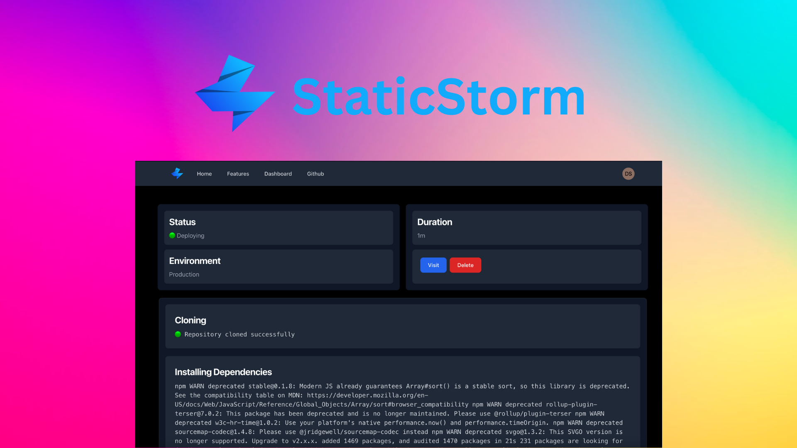

# StaticStorm

## Unleash the power of simple, fast and secure websites.



<hr>

Visit At <a href="http://staticstorm.coderush.tech" target="_blank">staticstorm.coderush.tech</a>

## Deployment

### Deploying Backend

To deploy the backend. Make a new Linux Linode. Install Nginx and NodeJS. Then run the following commands.

<hr>

```bash
  git clone https://github.com/devarshishimpi/staticstormhackathon
```

```bash
  cd backend
```

```bash
  npm install
```

```bash
  sudo cp -rf . /var/www/html
```

```bash
  sudo vim /etc/nginx/sites-available/default
```

Edit the file and change the following section to this

```nginx
server {
    listen 80;
    server_name _;

    location / {
        proxy_pass http://localhost:8181;
        proxy_set_header Host $host;
        proxy_set_header X-Real-IP $remote_addr;
        proxy_set_header X-Forwarded-For $proxy_add_x_forwarded_for;
    }
}
```

```bash
  sudo service nginx restart
```
 
Then go to `http://yourip:30001`


### Deploying Frontend

To deploy the frontend. Make a new Linux Linode. Install Nginx and NodeJS. Then run the following commands.

<hr>

```bash
  git clone https://github.com/devarshishimpi/staticstormhackathon
```

```bash
  cd frontend
```

```bash
  npm install
```

```bash
  npm run build
```

```bash
  sudo cp -rf build /var/www/html
```

```bash
  sudo vim /etc/nginx/sites-available/default
```

Edit the file and change the following section to this

```nginx
    server {
            listen 80 default_server;
            listen [::]:80 default_server;

            root /var/www/html/build;

            index index.html index.htm index.nginx-debian.html;

            server_name _;

            location / {
                    try_files $uri $uri/ /index.html;
            }
    }
```

```bash
  sudo service nginx restart
```

Navigate to `http://youripaddress`